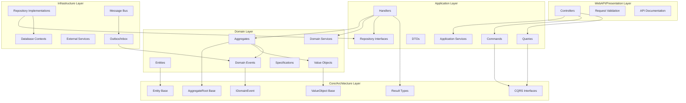
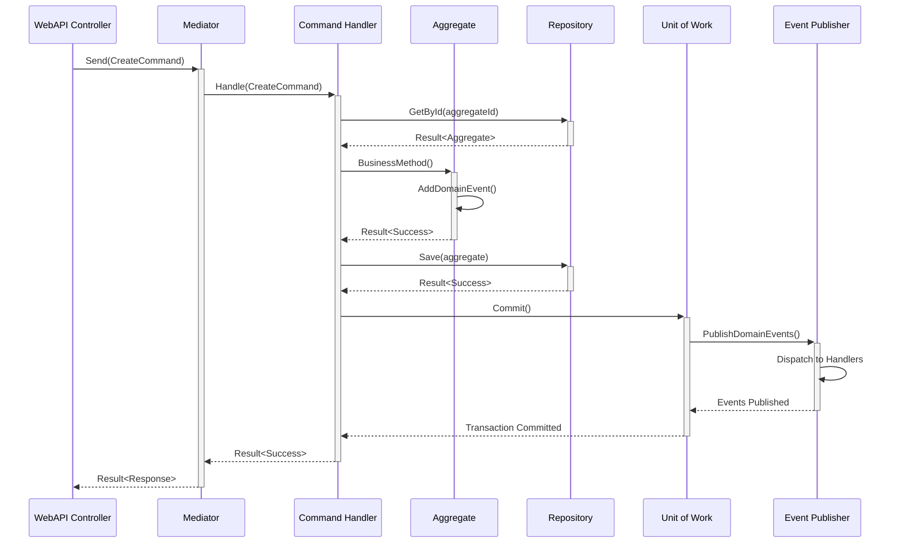
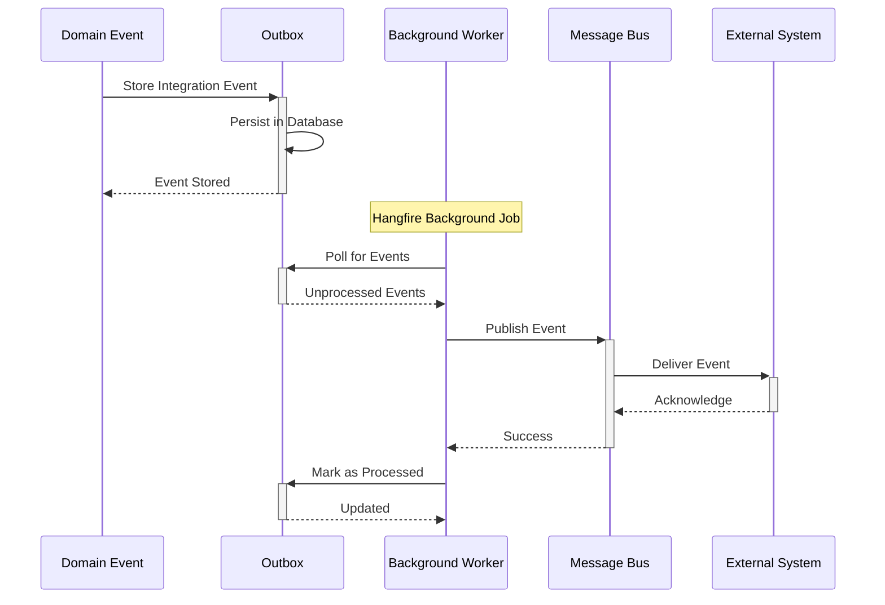

# build-project-architecture - Task 8

Execute task 8 for the build-project-architecture specification.

## Task Description
Create SpecificationBase abstract class in Core.Architecture

## Code Reuse
**Leverage existing code**: reference/DDD4rchitectureDotNet/src/Architecture/Core/SpecificationBase.cs

## Requirements Reference
**Requirements**: 2.4, 5.1

## Usage
```
/Task:8-build-project-architecture
```

## Instructions

Execute with @spec-task-executor agent the following task: "Create SpecificationBase abstract class in Core.Architecture"

```
Use the @spec-task-executor agent to implement task 8: "Create SpecificationBase abstract class in Core.Architecture" for the build-project-architecture specification and include all the below context.

# Steering Context
## Steering Documents Context (Pre-loaded)

### Product Context
# Product Vision & Objectives

## Product Purpose
Educational and reference repository for Domain-Driven Design (DDD) architecture across multiple programming languages, demonstrating specification-driven development workflows and comprehensive DDD implementation patterns.

## Target Users
- **Software Architects**: Learning and applying enterprise-grade DDD patterns
- **Senior Developers**: Understanding clean architecture and domain modeling
- **Development Teams**: Adopting spec-driven development workflows
- **Students & Educators**: Learning DDD principles through practical implementations

## Core Value Proposition
Provides comprehensive, multi-language reference implementations that demonstrate how to build DDD-compliant applications following specification-driven development workflows with consistent architectural patterns across different technology stacks.

## Key Features
- **Multi-Language DDD Implementations**: .NET, Java, Python with planned Golang and Node.js/TypeScript
- **Specification-Driven Workflow**: Complete workflow from requirements to implementation following spec-driven development
- **Architectural Consistency**: Same DDD patterns implemented idiomatically across all languages
- **Comprehensive Examples**: Real-world scenarios demonstrating aggregate design, event sourcing, and CQRS
- **Educational Resources**: Guidelines, templates, and architectural documentation

## Primary Success Metrics
**能夠按照 spec-driven development 的工作流程，依據 task 的編排實作出 ddd 的專案 architecture**

Success is measured by the ability to follow specification-driven development workflows and implement DDD project architectures based on properly organized tasks and specifications.

## Business Objectives
1. **Educational Excellence**: Serve as the definitive reference for DDD implementation across multiple languages
2. **Workflow Demonstration**: Showcase complete spec-driven development processes from requirements to deployment
3. **Pattern Consistency**: Maintain architectural consistency while leveraging language-specific strengths
4. **Community Resource**: Provide reusable templates, agents, and guidelines for DDD projects
5. **Practical Application**: Bridge the gap between DDD theory and real-world implementation

## Quality Standards
- All implementations must follow the established DDD patterns outlined in Guidelines.md
- Code must be readable and educational, even if minor performance costs are incurred
- Each language implementation should demonstrate idiomatic approaches while maintaining architectural consistency
- Comprehensive testing across all layers (unit, integration, architecture, e2e)
- Clear documentation and specification examples for each feature

## Future Roadmap
- **Language Expansion**: Add Golang and Node.js/TypeScript implementations
- **Enhanced Tooling**: Develop additional agents and templates for common DDD scenarios
- **Advanced Patterns**: Implement complex scenarios like saga patterns, event sourcing projections
- **Community Integration**: Enable contribution workflows and community-driven examples

---

### Technology Context
# Technology Stack & Standards

## Current Language Implementations

### .NET Implementation
- **Framework**: .NET 8.0
- **ORM**: Entity Framework Core 8.0
- **CQRS**: MediatR for command/query mediation
- **Database**: MySQL with Entity Framework migrations
- **Messaging**: RabbitMQ via MassTransit for integration events
- **Background Jobs**: Hangfire for processing outbox messages
- **Testing**: xUnit, FluentAssertions, Moq
- **Functional Programming**: CSharpFunctionalExtensions for Result<T> pattern
- **API Documentation**: Swagger/OpenAPI
- **Container**: Docker Compose support

### Java Implementation  
- **Framework**: Spring Boot 3.2.0
- **Java Version**: Java 17
- **ORM**: Hibernate 6.4.0
- **CQRS**: PipelinR (MediatR equivalent for Java)
- **Database**: MySQL with Liquibase migrations
- **Functional Programming**: Vavr for functional patterns (Try<T>, Either<L,R>)
- **Testing**: JUnit, AssertJ
- **Build Tool**: Maven
- **API Documentation**: SpringDoc OpenAPI
- **Database Testing**: H2 in-memory database

### Python Implementation
- **Framework**: Custom DDD framework implementation
- **Architecture**: Clean Architecture with DDD patterns
- **Functional Programming**: Custom Result<T> and Either<L,R> implementations
- **Testing**: (Framework to be determined based on implementation)
- **Type Safety**: Type hints and ABC enforcement
- **CQRS**: Custom mediator pattern implementation

### Planned Implementations
- **Golang**: Planned future implementation
- **Node.js/TypeScript**: Planned future implementation

## Cross-Language Consistency Requirements

### Shared Architectural Patterns
- **CQRS**: Command/Query separation with mediator pattern
- **Event Sourcing**: Domain events (internal) + Integration events (cross-boundary)
- **Repository Pattern**: With Unit of Work for transactional consistency
- **Functional Error Handling**: Result<T> pattern across all languages
- **Aggregate Design**: Strong-typed identity, domain event handling, invariant enforcement
- **Specification Pattern**: Complex domain rules in dedicated specification classes

### Database and Persistence
- **Primary Database**: MySQL for production scenarios
- **Test Databases**: In-memory or containerized databases for testing
- **Migration Strategy**: Language-specific migration tools (EF, Liquibase, etc.)
- **Connection Management**: Connection pooling and proper resource disposal

## Performance Requirements

**沒有特殊的性能要求，因為可讀而產生小量的性能損耗是可接受的**

Performance philosophy prioritizes:
1. **Code Readability**: Clear, educational code over micro-optimizations
2. **Architectural Integrity**: Proper separation of concerns over performance shortcuts
3. **Acceptable Trade-offs**: Minor performance costs for maintainability and educational value are acceptable
4. **Baseline Standards**: Must meet reasonable response times for reference application scenarios
5. **Monitoring**: Basic performance monitoring to ensure implementations remain within acceptable bounds

## Development Tools & Standards

### Version Control
- **Git Workflow**: Feature branches with pull request reviews
- **Commit Standards**: Conventional commits with clear, descriptive messages
- **Branch Protection**: Require reviews and automated checks before merging

### Testing Requirements
- **Coverage**: Comprehensive testing across all architectural layers
- **Test Organization**: Clear separation of unit, integration, architecture, and e2e tests
- **Test Naming**: Follow `Should_ExpectedBehavior_When_Condition` pattern
- **Test Structure**: Use Given/When/Then comment markers for test phase delineation

### Documentation Standards
- **API Documentation**: OpenAPI/Swagger for all HTTP endpoints  
- **Code Documentation**: Focus on domain concepts and business rules
- **Architecture Documentation**: ADRs for significant decisions
- **Deployment Guides**: Clear setup and deployment instructions

## Infrastructure & DevOps

### Containerization
- **Docker**: Containerized applications for consistent development environments
- **Docker Compose**: Local development with dependent services (databases, message queues)
- **Container Registries**: Standard container publishing workflows

### CI/CD Requirements
- **Automated Testing**: Run all test suites on every commit
- **Build Validation**: Ensure successful builds across all language implementations
- **Quality Gates**: Code coverage, architectural compliance, security scanning
- **Deployment**: Automated deployment to development/staging environments

## Security Standards

### Application Security
- **Authentication**: OAuth 2.0/JWT for API authentication
- **Authorization**: Role-based access control at domain boundaries
- **Data Protection**: Encrypt sensitive data at rest and in transit
- **Input Validation**: Comprehensive input validation at API boundaries

### Development Security
- **Dependency Scanning**: Regular security updates for all dependencies
- **Secret Management**: No hardcoded secrets, use environment variables/key vaults
- **Code Analysis**: Static analysis security testing (SAST) in CI pipeline

## Technology Decision Criteria

When adding new technologies or frameworks:
1. **Educational Value**: Does it demonstrate important DDD/architectural concepts?
2. **Language Idioms**: Does it follow the target language's best practices?
3. **Maintenance Overhead**: Can it be reasonably maintained as a reference implementation?
4. **Cross-Language Consistency**: Can similar patterns be implemented in other target languages?
5. **Community Standards**: Is it a well-established, community-supported solution?

---

### Structure Context
# Project Structure & Conventions

## Repository Organization

### Root Level Structure
```
├── .claude/                    # Claude Code configuration and agents
│   ├── agents/                # Specialized agents for complex tasks
│   ├── commands/              # Custom commands for spec-driven workflow
│   ├── steering/              # This directory - project guidance documents
│   ├── specs/                 # Generated specifications
│   └── templates/             # Templates for various document types
├── reference/                  # Multi-language DDD reference implementations
│   ├── DDD4rchitectureDotNet/ # Primary .NET DDD implementation
│   ├── DDD4rchitectureJ/      # Java Spring Boot DDD implementation
│   ├── DDD4rchitecturePy/     # Python DDD implementation
│   └── [Future: Golang, Node.js/TypeScript]
├── Guidelines.md              # **READ FIRST** - Comprehensive architectural guidance
└── CLAUDE.md                  # Repository-wide instructions for Claude Code
```

### Language Implementation Structure
Each language implementation follows the same layered architecture:

```
├── Core/Architecture/          # Framework-agnostic DDD building blocks
├── Domain/                    # Pure business logic and domain models
├── Application/               # Use cases, commands, queries, handlers
├── Infrastructure/            # External concerns (data, messaging, etc.)
├── WebAPI/Presentation/       # HTTP endpoints and presentation logic
└── test/                     # Comprehensive test suites
    ├── unit/                 # Domain and application logic tests
    ├── integration/          # Infrastructure and cross-layer tests
    ├── architecture/         # Architecture and design rule tests
    └── e2e/                  # End-to-end API tests
```

## Naming Conventions

### General Principles
- **Domain Terminology**: Use business domain vocabulary consistently across all languages
- **Intention-Revealing**: Names should clearly express purpose and behavior
- **Language-Specific**: Follow platform conventions while maintaining domain consistency
- **Cross-Language Alignment**: Same concepts should have recognizable names across implementations

### DDD Component Naming
- **Aggregates**: Nouns representing business concepts (Order, Customer, Product)
- **Domain Services**: Verbs describing business processes (OrderPricingService, InventoryAllocationService)
- **Commands**: Imperative verbs (CreateOrderCommand, UpdateCustomerAddressCommand)
- **Queries**: Descriptive phrases (GetOrderByIdQuery, SearchCustomersQuery)
- **Events**: Past tense verbs (OrderCreatedEvent, PaymentProcessedEvent)
- **Value Objects**: Descriptive nouns (Money, Address, ProductCode)
- **Specifications**: Business rule descriptions (CustomerHasValidCreditSpecification)

### File and Directory Naming
- **Consistent Casing**: Follow language conventions (PascalCase for .NET, camelCase for Java, snake_case for Python)
- **Clear Hierarchy**: Directory structure reflects architectural layers
- **Test Organization**: Mirror source structure in test directories
- **Shared Concepts**: Same logical groupings across all language implementations

## Coding Standards

### Test Standards - ALL LANGUAGES
**Test method naming conventions strictly follow the `Should_ExpectedBehavior_When_Condition` pattern for readability and clarity.**

**Each test method clearly delineates test phases using comment markers:**
- `// Given`: Test preconditions and setups  
- `// When`: Execution of the functionality under test
- `// Then`: Verification of outcomes and assertions

Example:
```csharp
[Fact]
public void Should_CreateOrder_When_ValidCustomerAndProducts()
{
    // Given
    var customerId = new CustomerId(Guid.NewGuid());
    var products = new List<ProductId> { new ProductId(Guid.NewGuid()) };
    
    // When  
    var result = Order.Create(customerId, products);
    
    // Then
    result.IsSuccess.Should().BeTrue();
    result.Value.CustomerId.Should().Be(customerId);
}
```

### Language-Specific Standards

#### .NET Standards
- **Coding Style**: Follow Microsoft C# Coding Conventions
- **Async/Await**: Use async/await for I/O operations
- **LINQ**: Leverage LINQ for collection operations
- **Nullable Reference Types**: Enable and use nullable reference types
- **XML Documentation**: Document public APIs with XML comments

#### Java Standards  
- **Coding Style**: Follow Google Java Style Guide
- **Stream API**: Use Stream API for collection processing
- **Optional**: Use Optional<T> for potentially null values
- **Lombok**: Use Lombok annotations to reduce boilerplate
- **JavaDoc**: Document public APIs with JavaDoc comments

#### Python Standards
- **Coding Style**: Follow PEP 8 Style Guide
- **Type Hints**: Use comprehensive type hints throughout
- **Docstrings**: Follow Google/NumPy docstring conventions
- **Abstract Base Classes**: Use ABC for interface definitions
- **Dataclasses**: Use dataclasses for simple data containers

## Layer Dependencies & Architecture Rules

### Strict Dependency Rules
- **Domain** → Core/Architecture (only)
- **Application** → Domain + Core/Architecture  
- **Infrastructure** → Application + Domain + Core/Architecture
- **WebAPI/Presentation** → Application + Infrastructure + Domain + Core/Architecture

**Critical Rule**: No circular dependencies between layers. Higher layers can depend on lower layers, never the reverse.

### Domain Layer Purity
- **No Infrastructure Dependencies**: Domain layer must remain pure
- **Framework Agnostic**: No references to web frameworks, databases, or external services
- **Business Logic Focus**: Contains only domain entities, value objects, services, and events
- **Interface Definitions**: Define repository interfaces, but no implementations

### Application Layer Responsibilities  
- **Use Case Orchestration**: Command and query handlers coordinate domain operations
- **Transaction Management**: Define transaction boundaries
- **Domain Event Handling**: Process domain events within bounded context
- **DTO Definitions**: Define data transfer objects for external communication

## File Organization Patterns

### Source Code Organization
- **Feature Folders**: Group related domain concepts together
- **Layer Separation**: Clear physical separation between architectural layers  
- **Shared Kernel**: Common concepts in Core/Architecture layer
- **Test Mirroring**: Test structure mirrors source structure exactly

### Configuration and Settings
- **Environment-Specific**: Separate configurations for development, testing, production
- **Secret Management**: No secrets in source control, use environment variables
- **Database Connections**: Configurable connection strings and providers
- **Feature Flags**: Support for feature toggles and A/B testing

## Documentation Standards

### Code Documentation
- **Domain Concepts**: Focus documentation on business rules and domain concepts
- **API Documentation**: Comprehensive OpenAPI/Swagger specifications
- **Architecture Decisions**: Document significant decisions in ADR format
- **Setup Instructions**: Clear, step-by-step setup and deployment guides

### Specification Documentation
- **Requirements**: Business requirements in executable specification format
- **Acceptance Criteria**: Clear, testable acceptance criteria for all features
- **Domain Glossary**: Shared vocabulary across all implementations
- **Integration Contracts**: API contracts and event schemas

## Review and Contribution Processes

### Code Review Requirements
- **Architectural Compliance**: Verify adherence to layer dependencies and DDD patterns
- **Test Coverage**: Ensure comprehensive test coverage across all layers
- **Domain Model Protection**: Verify domain model remains pure and encapsulated
- **Cross-Language Consistency**: Ensure implementations align with other language versions
- **Performance Considerations**: Review for acceptable performance characteristics
- **Security Review**: Check for security vulnerabilities and proper data handling

### Contribution Workflow
1. **Issue Creation**: Clear problem statement and acceptance criteria
2. **Design Review**: Architectural design review for significant changes
3. **Implementation**: Follow spec-driven development workflow
4. **Testing**: Comprehensive test suite with all test types
5. **Documentation**: Update specifications and architectural documentation
6. **Review Process**: Peer review focusing on architectural compliance
7. **Integration**: Automated CI/CD pipeline validation
8. **Deployment**: Staged deployment with monitoring and rollback capability

### Quality Gates
- **Build Success**: All language implementations must build successfully
- **Test Coverage**: Maintain minimum coverage thresholds for critical paths
- **Architecture Tests**: Automated verification of architectural constraints
- **Performance Baselines**: Performance regression testing
- **Security Scanning**: Automated security vulnerability scanning
- **Documentation Currency**: Ensure documentation remains current with implementation

## Spec-Driven Development Integration

### Workflow Integration
- **Specification First**: All features begin with business specifications
- **Task Breakdown**: Clear task organization following specification structure
- **Agent Utilization**: Leverage specialized agents for complex architectural tasks
- **Template Usage**: Use established templates for consistent documentation
- **Iterative Refinement**: Continuous refinement based on feedback and validation

### Template Organization
- **Bug Analysis & Reports**: Structured bug investigation and reporting
- **Design Documents**: Technical design and architecture planning
- **Requirements**: Business requirements and acceptance criteria
- **Task Planning**: Implementation task breakdown and organization
- **Verification**: Testing and validation procedures

This structure ensures consistency across all language implementations while allowing for language-specific idioms and best practices. All changes should align with these conventions to maintain the educational and reference value of the repository.

**Note**: Steering documents have been pre-loaded. Do not use get-content to fetch them again.

# Specification Context
## Specification Context (Pre-loaded): build-project-architecture

### Requirements
# Requirements Document

## Introduction

This feature specification defines the requirements for replicating the established .NET DDD project architecture pattern to create new language implementations or new projects that follow the same architectural standards. The goal is to systematically build a project structure that adheres to the Domain-Driven Design principles, layered architecture patterns, and cross-language consistency requirements documented in this repository.

## Alignment with Product Vision

This feature directly supports the primary success metric: **能夠按照 spec-driven development 的工作流程，依據 task 的編排實作出 ddd 的專案 architecture** (ability to follow specification-driven development workflows and implement DDD project architectures based on properly organized tasks).

The feature aligns with key product objectives:
- **Educational Excellence**: Demonstrates systematic DDD architecture creation
- **Workflow Demonstration**: Showcases complete spec-driven development process
- **Pattern Consistency**: Maintains architectural consistency across implementations
- **Practical Application**: Bridges DDD theory with real-world implementation

## Requirements

### Requirement 1: Layered Architecture Foundation

**User Story:** As a software architect, I want to establish a clean layered architecture foundation, so that I can ensure proper separation of concerns and maintainable code organization.

#### Acceptance Criteria

1. WHEN creating a new project THEN the system SHALL establish the five core architectural layers
2. IF the layered structure is created THEN it SHALL follow the dependency rules: Domain → Core/Architecture, Application → Domain + Core/Architecture, Infrastructure → Application + Domain + Core/Architecture, WebAPI → All lower layers
3. WHEN setting up layers THEN each layer SHALL have clear boundaries with no circular dependencies
4. IF implementing layer structure THEN it SHALL mirror the reference implementation patterns from DDD4rchitectureDotNet

### Requirement 2: DDD Building Blocks Implementation

**User Story:** As a domain modeler, I want comprehensive DDD building blocks available, so that I can implement rich domain models with proper encapsulation and business logic.

#### Acceptance Criteria

1. WHEN implementing Core/Architecture layer THEN it SHALL provide base classes for AggregateRoot, Entity, ValueObject, and DomainEvent
2. IF creating domain building blocks THEN they SHALL support strong-typed identity management with appropriate ID generation strategies
3. WHEN implementing aggregates THEN they SHALL include domain event collection and clearing mechanisms (AddDomainEvent(), ClearDomainEvents())
4. IF implementing specifications THEN they SHALL provide functional validation returning Result<T> patterns
5. WHEN creating value objects THEN they SHALL be immutable with structural equality and self-validation

### Requirement 3: CQRS Pattern Implementation

**User Story:** As an application developer, I want a complete CQRS implementation with mediator pattern, so that I can separate commands and queries with proper orchestration.

#### Acceptance Criteria

1. WHEN implementing CQRS THEN the system SHALL provide ICommand, IQuery, ICommandHandler, and IQueryHandler interfaces
2. IF setting up mediator pattern THEN it SHALL integrate with MediatR for .NET or equivalent for other languages
3. WHEN creating command handlers THEN they SHALL return Result<T> for functional error handling
4. IF implementing queries THEN they SHALL be side-effect free and return strongly-typed DTOs
5. WHEN setting up CQRS infrastructure THEN it SHALL include UnitOfWork behavior for transactional consistency

### Requirement 4: Event-Driven Architecture Support

**User Story:** As a system integrator, I want comprehensive event-driven architecture support, so that I can implement domain events and integration events with reliable delivery.

#### Acceptance Criteria

1. WHEN implementing domain events THEN they SHALL extend IDomainEvent interface and integrate with mediator pattern
2. IF creating integration events THEN the system SHALL implement Outbox pattern for reliable event publishing
3. WHEN setting up event infrastructure THEN it SHALL include Inbox pattern for external event handling with deduplication
4. IF implementing event workers THEN they SHALL provide background processing for asynchronous event handling
5. WHEN configuring messaging THEN it SHALL support integration with message brokers (RabbitMQ via MassTransit or equivalent)

### Requirement 5: Functional Error Handling

**User Story:** As a developer, I want consistent functional error handling throughout the application, so that I can avoid exceptions for business logic and maintain clean error propagation.

#### Acceptance Criteria

1. WHEN implementing error handling THEN all operations SHALL return Result<T> or equivalent functional types
2. IF handling domain errors THEN they SHALL be encapsulated in the domain layer without infrastructure dependencies
3. WHEN processing application errors THEN they SHALL be handled in application layer with appropriate result types
4. IF encountering infrastructure errors THEN they SHALL be handled with retry/circuit breaker patterns where appropriate

### Requirement 6: Repository and Persistence Patterns

**User Story:** As a data access developer, I want proper repository and persistence patterns, so that I can maintain clean separation between domain and infrastructure concerns.

#### Acceptance Criteria

1. WHEN implementing repositories THEN interfaces SHALL be defined in application layer with implementations in infrastructure layer
2. IF setting up persistence THEN it SHALL implement Unit of Work pattern for transactional consistency
3. WHEN configuring database access THEN it SHALL support Entity Framework Core or equivalent ORM with proper configuration
4. IF implementing data access THEN it SHALL provide separate contexts for transactional operations and read-only queries
5. WHEN setting up migrations THEN it SHALL support database schema evolution with proper migration strategies

### Requirement 7: Testing Infrastructure

**User Story:** As a quality assurance engineer, I want comprehensive testing infrastructure, so that I can ensure code quality across all architectural layers.

#### Acceptance Criteria

1. WHEN setting up testing THEN it SHALL provide separate test projects for unit, integration, and architecture tests
2. IF implementing unit tests THEN they SHALL follow the Should_ExpectedBehavior_When_Condition naming convention
3. WHEN creating test structure THEN it SHALL use Given/When/Then comment markers for test phase delineation
4. IF setting up integration tests THEN they SHALL use test containers or in-memory databases for isolated testing
5. WHEN implementing architecture tests THEN they SHALL validate layer dependencies and architectural constraints

### Requirement 8: Cross-Language Consistency

**User Story:** As a multi-platform developer, I want consistent architectural patterns across different programming languages, so that I can maintain conceptual alignment while leveraging language-specific strengths.

#### Acceptance Criteria

1. WHEN implementing in different languages THEN core DDD concepts SHALL maintain consistent structure and behavior
2. IF adapting for specific languages THEN patterns SHALL leverage language idioms while maintaining architectural integrity
3. WHEN creating language-specific implementations THEN they SHALL follow documented technology standards from tech.md
4. IF implementing cross-language patterns THEN naming conventions SHALL maintain domain consistency with platform-appropriate casing

## Non-Functional Requirements

### Performance
- Code readability and educational value take precedence over micro-optimizations
- Minor performance costs for maintainability are acceptable
- Implementations must meet reasonable response times for reference application scenarios

### Security
- No hardcoded secrets or credentials in source code
- Proper input validation at all API boundaries
- Authentication and authorization integration points must be provided

### Reliability
- Functional error handling must prevent exceptions from business logic failures
- Outbox/Inbox patterns must ensure reliable event delivery
- Database operations must maintain ACID properties through Unit of Work

### Usability
- Clear separation of concerns must be maintained for educational clarity
- Comprehensive documentation and examples must be provided
- Project structure must follow established conventions from structure.md

---

### Design
# Design Document

## Overview

This design document outlines the systematic approach to replicating the established .NET Domain-Driven Design (DDD) project architecture. The design focuses on creating a comprehensive, layered architecture that embodies DDD principles while maintaining educational clarity and cross-language consistency. The architecture will serve as a template for new projects and language implementations, ensuring consistent patterns across the entire repository ecosystem.

The design leverages the proven patterns from the existing DDD4rchitectureDotNet reference implementation while providing flexibility for language-specific adaptations. This approach ensures both architectural integrity and practical implementability across multiple technology stacks.

## Steering Document Alignment

### Technical Standards (tech.md)

**Framework Integration**: The design follows documented technology standards:
- **.NET 8.0** with nullable reference types for type safety
- **MediatR** for CQRS and domain event mediation
- **CSharpFunctionalExtensions** for functional programming patterns (Result<T>)
- **Entity Framework Core 8.0** for persistence with transactional and read-only contexts
- **MassTransit + RabbitMQ** for reliable integration event messaging
- **Hangfire** for background job processing
- **xUnit + FluentAssertions + Moq** for comprehensive testing

**Cross-Language Adaptability**: Design accommodates equivalent patterns for Java (Spring Boot, Vavr, PipelinR) and Python (custom functional implementations) while maintaining conceptual consistency.

**Performance Philosophy**: Prioritizes code readability and educational value over micro-optimizations, accepting minor performance costs for maintainability and clarity.

### Project Structure (structure.md)

**Layer Organization**: Strict adherence to established dependency rules:
```
Domain → Core/Architecture (only)
Application → Domain + Core/Architecture
Infrastructure → Application + Domain + Core/Architecture
WebAPI/Presentation → All lower layers
```

**Naming Conventions**: Follows documented standards:
- **Aggregates**: Business concept nouns (Order, Customer, Product)
- **Commands**: Imperative verbs (CreateOrderCommand, UpdateCustomerCommand)
- **Queries**: Descriptive phrases (GetOrderByIdQuery, SearchCustomersQuery)
- **Events**: Past tense verbs (OrderCreatedEvent, CustomerUpdatedEvent)
- **Domain Services**: Business process verbs (OrderPricingService, InventoryAllocationService)

**Testing Structure**: Implements comprehensive testing strategy with Given/When/Then markers and Should_ExpectedBehavior_When_Condition naming conventions.

## Code Reuse Analysis

### Existing Components to Leverage

**Core Architecture Foundation**:
- **AggregateRoot<TId>**: Base class from `/reference/DDD4rchitectureDotNet/src/Architecture/Core/AggregateRoot.cs` providing domain event handling and identity management
- **IAggregateRoot**: Interface defining domain event collection behavior
- **IDomainEvent**: Base interface extending MediatR.INotification for domain events
- **SpecificationBase<T>**: Functional validation base class returning Result<T>
- **Result<T> Extensions**: CSharpFunctionalExtensions integration for functional error handling

**CQRS Infrastructure**:
- **ICommand/IQuery Interfaces**: From `/reference/DDD4rchitectureDotNet/src/Architecture/Shell/CQRS/` providing command/query contracts
- **ICommandHandler/IQueryHandler**: Handler interfaces with functional return types
- **UnitOfWorkBehavior**: MediatR pipeline behavior for transactional consistency
- **Mediator Integration**: Established MediatR configuration patterns

**Event-Driven Components**:
- **Outbox Pattern**: Transactional outbox implementation from `/reference/DDD4rchitectureDotNet/src/Architecture/Shell/EventBus/Outbox/`
- **Inbox Pattern**: External event handling with deduplication
- **OutboxWorker**: Hangfire-based background event processing
- **Integration Event Base Classes**: Established event schema patterns

**Infrastructure Utilities**:
- **SystemDateTime**: Testable time abstraction
- **IdGenerator**: Sequential GUID generation utility
- **Generic Type Extensions**: Reflection utilities for dynamic service registration
- **Correlation Service**: Request correlation across boundaries

### Integration Points

**Database Integration**: 
- **Entity Framework Contexts**: Reuse existing transactional and read-only context patterns
- **Migration Strategy**: Leverage established EF Core migration approaches
- **Repository Interfaces**: Build upon existing repository contract patterns in application layer

**Messaging Integration**:
- **MassTransit Configuration**: Extend existing message broker integration patterns
- **Event Bus Abstractions**: Utilize established event publishing abstractions
- **Background Processing**: Integrate with existing Hangfire worker patterns

**Testing Integration**:
- **Test Harness Patterns**: Leverage MassTransit test harness for integration testing
- **Test Utilities**: Reuse existing test data factories and assertion helpers
- **Architecture Tests**: Extend existing dependency validation patterns

## Architecture

The architecture implements a five-layer design with clear separation of concerns and strict dependency management:



## Components and Interfaces

### Core/Architecture Layer Components

**AggregateRoot<TId>**
- **Purpose**: Base class for all aggregate roots providing domain event management and identity handling
- **Interfaces**: 
  ```csharp
  public abstract class AggregateRoot<TId> : Entity<TId>, IAggregateRoot
  {
      public void AddDomainEvent(IDomainEvent domainEvent);
      public void ClearDomainEvents();
      public IReadOnlyCollection<IDomainEvent> DomainEvents { get; }
  }
  ```
- **Dependencies**: Entity<TId>, IDomainEvent collection
- **Reuses**: Existing AggregateRoot implementation patterns

**CQRS Interfaces**
- **Purpose**: Define contracts for command/query separation with mediator pattern
- **Interfaces**:
  ```csharp
  public interface ICommand : IRequest<Result> { }
  public interface ICommand<TResponse> : IRequest<Result<TResponse>> { }
  public interface IQuery<TResponse> : IRequest<Result<TResponse>> { }
  public interface ICommandHandler<TCommand> : IRequestHandler<TCommand, Result> where TCommand : ICommand { }
  public interface IQueryHandler<TQuery, TResponse> : IRequestHandler<TQuery, Result<TResponse>> where TQuery : IQuery<TResponse> { }
  ```
- **Dependencies**: MediatR, CSharpFunctionalExtensions
- **Reuses**: Established CQRS interface patterns

**Specification Base**
- **Purpose**: Functional validation with Result<T> return patterns
- **Interfaces**:
  ```csharp
  public abstract class SpecificationBase<T>
  {
      public abstract Result<T> IsSatisfiedBy(T candidate);
      public static SpecificationBase<T> Create(Func<T, Result<T>> specification);
  }
  ```
- **Dependencies**: Result<T> functional types
- **Reuses**: Existing specification validation patterns

### Domain Layer Components

**Sample Aggregate Structure**
- **Purpose**: Demonstrate proper aggregate design with business logic encapsulation
- **Interfaces**: Strong-typed identity, factory methods, business operations
- **Dependencies**: Core/Architecture base classes, domain events, value objects
- **Reuses**: SomethingAggregate pattern from reference implementation

**Value Object Patterns**
- **Purpose**: Immutable value objects with structural equality and validation
- **Interfaces**: Factory methods with Result<T> validation
- **Dependencies**: SpecificationBase<T> for validation
- **Reuses**: Existing value object validation patterns

**Domain Events**
- **Purpose**: Capture and communicate domain state changes
- **Interfaces**: IDomainEvent with specific event payloads
- **Dependencies**: MediatR.INotification integration
- **Reuses**: Established domain event patterns

### Application Layer Components

**Command/Query Handlers**
- **Purpose**: Orchestrate domain operations and coordinate with infrastructure
- **Interfaces**: ICommandHandler<T>, IQueryHandler<T,R> with Result<T> returns
- **Dependencies**: Domain aggregates, repository interfaces, mediator
- **Reuses**: Existing handler patterns with UnitOfWork behavior

**Repository Interfaces**
- **Purpose**: Define domain-focused data access contracts
- **Interfaces**: Generic repository interfaces with domain-specific operations
- **Dependencies**: Domain entities and aggregates
- **Reuses**: Established repository contract patterns

### Infrastructure Layer Components

**Repository Implementations**
- **Purpose**: Concrete data access implementations using Entity Framework
- **Interfaces**: Implement application layer repository interfaces
- **Dependencies**: EF DbContext, domain entities
- **Reuses**: Existing EF configuration and mapping patterns

**Event Bus Integration**
- **Purpose**: Reliable integration event publishing and handling
- **Interfaces**: Outbox/Inbox pattern implementation
- **Dependencies**: MassTransit, Hangfire, database contexts
- **Reuses**: Established event bus and background worker patterns

## Data Models

### Core Entity Structure
```csharp
// Strong-typed identity pattern
public readonly record struct SampleId(Guid Value)
{
    public static SampleId New() => new(IdGenerator.NextSequentialGuid());
    public static implicit operator Guid(SampleId id) => id.Value;
}

// Aggregate root implementation
public class SampleAggregate : AggregateRoot<SampleId>
{
    public SampleEntity Entity { get; private set; }
    public IReadOnlyList<SampleValueObject> ValueObjects { get; private set; }
    
    private SampleAggregate() : base() { } // EF Constructor
    
    public static SampleAggregate Create(SampleEntity entity, List<SampleValueObject> valueObjects)
    {
        var aggregate = new SampleAggregate(SampleId.New(), entity, valueObjects);
        aggregate.AddDomainEvent(new SampleAggregateCreatedDomainEvent(aggregate.Id));
        return aggregate;
    }
    
    public Result RenameEntity(string name)
    {
        var result = Entity.Rename(name);
        if (result.IsSuccess)
        {
            AddDomainEvent(new SampleEntityRenamedDomainEvent(Id, name));
        }
        return result;
    }
}
```

### Value Object Structure
```csharp
public class SampleValueObject : ValueObject
{
    public string StringValue { get; }
    public int NumberValue { get; }
    public DateTime DateTimeValue { get; }
    
    private SampleValueObject(string stringValue, int numberValue, DateTime dateTimeValue)
    {
        StringValue = stringValue;
        NumberValue = numberValue;
        DateTimeValue = dateTimeValue;
    }
    
    public static Result<SampleValueObject> Create(string stringValue, int numberValue, DateTime dateTimeValue)
    {
        var specification = SampleValueObjectSpecification.Create();
        var instance = new SampleValueObject(stringValue, numberValue, dateTimeValue);
        return specification.IsSatisfiedBy(instance);
    }
    
    protected override IEnumerable<object> GetAtomicValues()
    {
        yield return StringValue;
        yield return NumberValue;
        yield return DateTimeValue;
    }
}
```

## Error Handling

### Error Scenarios

1. **Domain Rule Violations**
   - **Handling**: Return Result.Failure with domain-specific error messages
   - **User Impact**: Clear business rule violation messages

2. **Infrastructure Failures**
   - **Handling**: Wrap in Result.Failure with infrastructure error context
   - **User Impact**: Generic "system temporarily unavailable" messages

3. **Validation Failures**
   - **Handling**: Specification pattern returns Result.Failure with validation details
   - **User Impact**: Specific field-level validation messages

4. **Concurrency Conflicts**
   - **Handling**: DbUpdateConcurrencyException wrapped in Result.Failure
   - **User Impact**: "Record was modified by another user" messages

## Testing Strategy

### Unit Testing
- **Approach**: Test domain logic in isolation using pure functions and specifications
- **Key Components**: 
  - Domain entity business methods
  - Value object validation and creation
  - Specification pattern validation logic
  - Command/query handler orchestration logic
- **Test Structure**: Given/When/Then with Should_ExpectedBehavior_When_Condition naming

### Integration Testing
- **Approach**: Test cross-layer interactions with real database and message bus
- **Key Flows**: 
  - Complete command/query execution through all layers
  - Domain event publishing and handling
  - Repository persistence and retrieval operations
  - Integration event publishing via outbox pattern
- **Infrastructure**: TestContainers for database, MassTransit test harness for messaging

### Architecture Testing
- **Approach**: Automated validation of architectural constraints and dependencies using NetArchTest.Rules
- **Key Validations**:
  - Layer dependency rules enforcement with automated dependency graph analysis
  - Naming convention compliance (Commands end with "Command", Queries with "Query", Events with "Event")
  - Domain purity verification ensuring no infrastructure dependencies in domain layer
  - Proper attribute usage validation for Entity Framework configurations
  - Aggregate root inheritance validation ensuring all aggregates inherit from AggregateRoot<T>
  - Interface implementation validation for CQRS handlers
- **Framework**: NetArchTest.Rules for .NET architectural constraint testing
- **Test Examples**:
  ```csharp
  [Fact]
  public void Domain_Should_Not_HaveDependencyOn_Infrastructure()
  {
      // Given
      var result = Types.InAssembly(DomainAssembly)
          .Should()
          .NotHaveDependencyOn("Infrastructure")
          .GetResult();
      
      // When & Then
      result.IsSuccessful.Should().BeTrue();
  }
  ```

### End-to-End Testing
- **Approach**: Complete user scenarios through HTTP API endpoints
- **User Scenarios**: 
  - Full business workflows from API request to database persistence
  - Integration event propagation across bounded contexts
  - Error handling and response formatting
- **Tools**: WebApplicationFactory for API testing, real database instances

## Sequence Diagrams

### Command Execution Flow


### Integration Event Processing Flow


**Note**: Specification documents have been pre-loaded. Do not use get-content to fetch them again.

## Task Details
- Task ID: 8
- Description: Create SpecificationBase abstract class in Core.Architecture
- Leverage: reference/DDD4rchitectureDotNet/src/Architecture/Core/SpecificationBase.cs
- Requirements: 2.4, 5.1

## Instructions
- Implement ONLY task 8: "Create SpecificationBase abstract class in Core.Architecture"
- Follow all project conventions and leverage existing code
- Mark the task as complete using: claude-code-spec-workflow get-tasks build-project-architecture 8 --mode complete
- Provide a completion summary
```

## Task Completion
When the task is complete, mark it as done:
```bash
claude-code-spec-workflow get-tasks build-project-architecture 8 --mode complete
```

## Next Steps
After task completion, you can:
- Execute the next task using /build-project-architecture-task-[next-id]
- Check overall progress with /spec-status build-project-architecture
