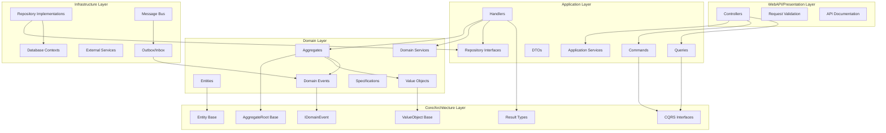
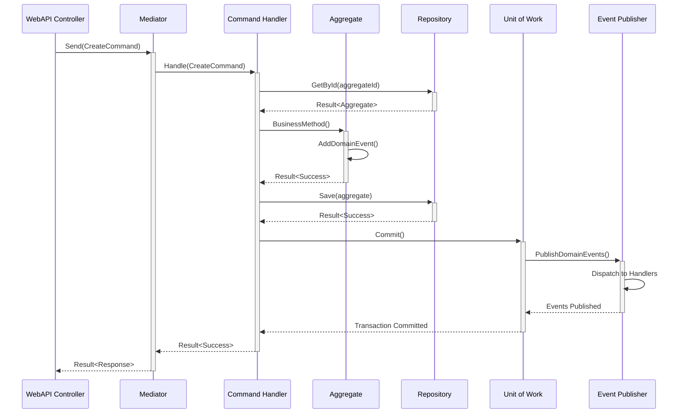
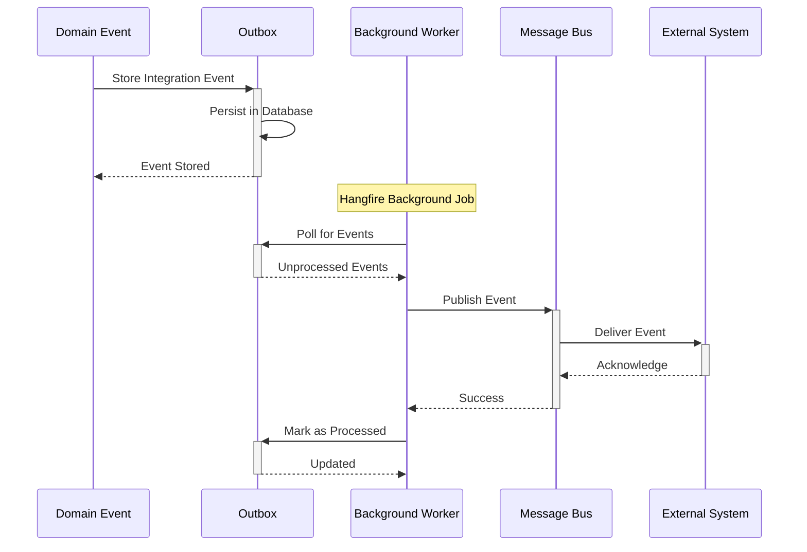

# Design Document

## Overview

This design document outlines the systematic approach to replicating the established .NET Domain-Driven Design (DDD) project architecture. The design focuses on creating a comprehensive, layered architecture that embodies DDD principles while maintaining educational clarity and cross-language consistency. The architecture will serve as a template for new projects and language implementations, ensuring consistent patterns across the entire repository ecosystem.

The design leverages the proven patterns from the existing DDD4rchitectureDotNet reference implementation while providing flexibility for language-specific adaptations. This approach ensures both architectural integrity and practical implementability across multiple technology stacks.

## Steering Document Alignment

### Technical Standards (tech.md)

**Framework Integration**: The design follows documented technology standards:
- **.NET 8.0** with nullable reference types for type safety
- **MediatR** for CQRS and domain event mediation
- **CSharpFunctionalExtensions** for functional programming patterns (Result<T>)
- **Entity Framework Core 8.0** for persistence with transactional and read-only contexts
- **MassTransit + RabbitMQ** for reliable integration event messaging
- **Hangfire** for background job processing
- **xUnit + FluentAssertions + Moq** for comprehensive testing

**Cross-Language Adaptability**: Design accommodates equivalent patterns for Java (Spring Boot, Vavr, PipelinR) and Python (custom functional implementations) while maintaining conceptual consistency.

**Performance Philosophy**: Prioritizes code readability and educational value over micro-optimizations, accepting minor performance costs for maintainability and clarity.

### Project Structure (structure.md)

**Layer Organization**: Strict adherence to established dependency rules:
```
Domain → Core/Architecture (only)
Application → Domain + Core/Architecture
Infrastructure → Application + Domain + Core/Architecture
WebAPI/Presentation → All lower layers
```

**Naming Conventions**: Follows documented standards:
- **Aggregates**: Business concept nouns (Order, Customer, Product)
- **Commands**: Imperative verbs (CreateOrderCommand, UpdateCustomerCommand)
- **Queries**: Descriptive phrases (GetOrderByIdQuery, SearchCustomersQuery)
- **Events**: Past tense verbs (OrderCreatedEvent, CustomerUpdatedEvent)
- **Domain Services**: Business process verbs (OrderPricingService, InventoryAllocationService)

**Testing Structure**: Implements comprehensive testing strategy with Given/When/Then markers and Should_ExpectedBehavior_When_Condition naming conventions.

## Code Reuse Analysis

### Existing Components to Leverage

**Core Architecture Foundation**:
- **AggregateRoot<TId>**: Base class from `/reference/DDD4rchitectureDotNet/src/Architecture/Core/AggregateRoot.cs` providing domain event handling and identity management
- **IAggregateRoot**: Interface defining domain event collection behavior
- **IDomainEvent**: Base interface extending MediatR.INotification for domain events
- **SpecificationBase<T>**: Functional validation base class returning Result<T>
- **Result<T> Extensions**: CSharpFunctionalExtensions integration for functional error handling

**CQRS Infrastructure**:
- **ICommand/IQuery Interfaces**: From `/reference/DDD4rchitectureDotNet/src/Architecture/Shell/CQRS/` providing command/query contracts
- **ICommandHandler/IQueryHandler**: Handler interfaces with functional return types
- **UnitOfWorkBehavior**: MediatR pipeline behavior for transactional consistency
- **Mediator Integration**: Established MediatR configuration patterns

**Event-Driven Components**:
- **Outbox Pattern**: Transactional outbox implementation from `/reference/DDD4rchitectureDotNet/src/Architecture/Shell/EventBus/Outbox/`
- **Inbox Pattern**: External event handling with deduplication
- **OutboxWorker**: Hangfire-based background event processing
- **Integration Event Base Classes**: Established event schema patterns

**Infrastructure Utilities**:
- **SystemDateTime**: Testable time abstraction
- **IdGenerator**: Sequential GUID generation utility
- **Generic Type Extensions**: Reflection utilities for dynamic service registration
- **Correlation Service**: Request correlation across boundaries

### Integration Points

**Database Integration**: 
- **Entity Framework Contexts**: Reuse existing transactional and read-only context patterns
- **Migration Strategy**: Leverage established EF Core migration approaches
- **Repository Interfaces**: Build upon existing repository contract patterns in application layer

**Messaging Integration**:
- **MassTransit Configuration**: Extend existing message broker integration patterns
- **Event Bus Abstractions**: Utilize established event publishing abstractions
- **Background Processing**: Integrate with existing Hangfire worker patterns

**Testing Integration**:
- **Test Harness Patterns**: Leverage MassTransit test harness for integration testing
- **Test Utilities**: Reuse existing test data factories and assertion helpers
- **Architecture Tests**: Extend existing dependency validation patterns

## Architecture

The architecture implements a five-layer design with clear separation of concerns and strict dependency management:



## Components and Interfaces

### Core/Architecture Layer Components

**AggregateRoot<TId>**
- **Purpose**: Base class for all aggregate roots providing domain event management and identity handling
- **Interfaces**: 
  ```csharp
  public abstract class AggregateRoot<TId> : Entity<TId>, IAggregateRoot
  {
      public void AddDomainEvent(IDomainEvent domainEvent);
      public void ClearDomainEvents();
      public IReadOnlyCollection<IDomainEvent> DomainEvents { get; }
  }
  ```
- **Dependencies**: Entity<TId>, IDomainEvent collection
- **Reuses**: Existing AggregateRoot implementation patterns

**CQRS Interfaces**
- **Purpose**: Define contracts for command/query separation with mediator pattern
- **Interfaces**:
  ```csharp
  public interface ICommand : IRequest<Result> { }
  public interface ICommand<TResponse> : IRequest<Result<TResponse>> { }
  public interface IQuery<TResponse> : IRequest<Result<TResponse>> { }
  public interface ICommandHandler<TCommand> : IRequestHandler<TCommand, Result> where TCommand : ICommand { }
  public interface IQueryHandler<TQuery, TResponse> : IRequestHandler<TQuery, Result<TResponse>> where TQuery : IQuery<TResponse> { }
  ```
- **Dependencies**: MediatR, CSharpFunctionalExtensions
- **Reuses**: Established CQRS interface patterns

**Specification Base**
- **Purpose**: Functional validation with Result<T> return patterns
- **Interfaces**:
  ```csharp
  public abstract class SpecificationBase<T>
  {
      public abstract Result<T> IsSatisfiedBy(T candidate);
      public static SpecificationBase<T> Create(Func<T, Result<T>> specification);
  }
  ```
- **Dependencies**: Result<T> functional types
- **Reuses**: Existing specification validation patterns

### Domain Layer Components

**Sample Aggregate Structure**
- **Purpose**: Demonstrate proper aggregate design with business logic encapsulation
- **Interfaces**: Strong-typed identity, factory methods, business operations
- **Dependencies**: Core/Architecture base classes, domain events, value objects
- **Reuses**: SomethingAggregate pattern from reference implementation

**Value Object Patterns**
- **Purpose**: Immutable value objects with structural equality and validation
- **Interfaces**: Factory methods with Result<T> validation
- **Dependencies**: SpecificationBase<T> for validation
- **Reuses**: Existing value object validation patterns

**Domain Events**
- **Purpose**: Capture and communicate domain state changes
- **Interfaces**: IDomainEvent with specific event payloads
- **Dependencies**: MediatR.INotification integration
- **Reuses**: Established domain event patterns

### Application Layer Components

**Command/Query Handlers**
- **Purpose**: Orchestrate domain operations and coordinate with infrastructure
- **Interfaces**: ICommandHandler<T>, IQueryHandler<T,R> with Result<T> returns
- **Dependencies**: Domain aggregates, repository interfaces, mediator
- **Reuses**: Existing handler patterns with UnitOfWork behavior

**Repository Interfaces**
- **Purpose**: Define domain-focused data access contracts
- **Interfaces**: Generic repository interfaces with domain-specific operations
- **Dependencies**: Domain entities and aggregates
- **Reuses**: Established repository contract patterns

### Infrastructure Layer Components

**Repository Implementations**
- **Purpose**: Concrete data access implementations using Entity Framework
- **Interfaces**: Implement application layer repository interfaces
- **Dependencies**: EF DbContext, domain entities
- **Reuses**: Existing EF configuration and mapping patterns

**Event Bus Integration**
- **Purpose**: Reliable integration event publishing and handling
- **Interfaces**: Outbox/Inbox pattern implementation
- **Dependencies**: MassTransit, Hangfire, database contexts
- **Reuses**: Established event bus and background worker patterns

## Data Models

### Core Entity Structure
```csharp
// Strong-typed identity pattern
public readonly record struct SampleId(Guid Value)
{
    public static SampleId New() => new(IdGenerator.NextSequentialGuid());
    public static implicit operator Guid(SampleId id) => id.Value;
}

// Aggregate root implementation
public class SampleAggregate : AggregateRoot<SampleId>
{
    public SampleEntity Entity { get; private set; }
    public IReadOnlyList<SampleValueObject> ValueObjects { get; private set; }
    
    private SampleAggregate() : base() { } // EF Constructor
    
    public static SampleAggregate Create(SampleEntity entity, List<SampleValueObject> valueObjects)
    {
        var aggregate = new SampleAggregate(SampleId.New(), entity, valueObjects);
        aggregate.AddDomainEvent(new SampleAggregateCreatedDomainEvent(aggregate.Id));
        return aggregate;
    }
    
    public Result RenameEntity(string name)
    {
        var result = Entity.Rename(name);
        if (result.IsSuccess)
        {
            AddDomainEvent(new SampleEntityRenamedDomainEvent(Id, name));
        }
        return result;
    }
}
```

### Value Object Structure
```csharp
public class SampleValueObject : ValueObject
{
    public string StringValue { get; }
    public int NumberValue { get; }
    public DateTime DateTimeValue { get; }
    
    private SampleValueObject(string stringValue, int numberValue, DateTime dateTimeValue)
    {
        StringValue = stringValue;
        NumberValue = numberValue;
        DateTimeValue = dateTimeValue;
    }
    
    public static Result<SampleValueObject> Create(string stringValue, int numberValue, DateTime dateTimeValue)
    {
        var specification = SampleValueObjectSpecification.Create();
        var instance = new SampleValueObject(stringValue, numberValue, dateTimeValue);
        return specification.IsSatisfiedBy(instance);
    }
    
    protected override IEnumerable<object> GetAtomicValues()
    {
        yield return StringValue;
        yield return NumberValue;
        yield return DateTimeValue;
    }
}
```

## Error Handling

### Error Scenarios

1. **Domain Rule Violations**
   - **Handling**: Return Result.Failure with domain-specific error messages
   - **User Impact**: Clear business rule violation messages

2. **Infrastructure Failures**
   - **Handling**: Wrap in Result.Failure with infrastructure error context
   - **User Impact**: Generic "system temporarily unavailable" messages

3. **Validation Failures**
   - **Handling**: Specification pattern returns Result.Failure with validation details
   - **User Impact**: Specific field-level validation messages

4. **Concurrency Conflicts**
   - **Handling**: DbUpdateConcurrencyException wrapped in Result.Failure
   - **User Impact**: "Record was modified by another user" messages

## Testing Strategy

### Unit Testing
- **Approach**: Test domain logic in isolation using pure functions and specifications
- **Key Components**: 
  - Domain entity business methods
  - Value object validation and creation
  - Specification pattern validation logic
  - Command/query handler orchestration logic
- **Test Structure**: Given/When/Then with Should_ExpectedBehavior_When_Condition naming

### Integration Testing
- **Approach**: Test cross-layer interactions with real database and message bus
- **Key Flows**: 
  - Complete command/query execution through all layers
  - Domain event publishing and handling
  - Repository persistence and retrieval operations
  - Integration event publishing via outbox pattern
- **Infrastructure**: TestContainers for database, MassTransit test harness for messaging

### Architecture Testing
- **Approach**: Automated validation of architectural constraints and dependencies using NetArchTest.Rules
- **Key Validations**:
  - Layer dependency rules enforcement with automated dependency graph analysis
  - Naming convention compliance (Commands end with "Command", Queries with "Query", Events with "Event")
  - Domain purity verification ensuring no infrastructure dependencies in domain layer
  - Proper attribute usage validation for Entity Framework configurations
  - Aggregate root inheritance validation ensuring all aggregates inherit from AggregateRoot<T>
  - Interface implementation validation for CQRS handlers
- **Framework**: NetArchTest.Rules for .NET architectural constraint testing
- **Test Examples**:
  ```csharp
  [Fact]
  public void Domain_Should_Not_HaveDependencyOn_Infrastructure()
  {
      // Given
      var result = Types.InAssembly(DomainAssembly)
          .Should()
          .NotHaveDependencyOn("Infrastructure")
          .GetResult();
      
      // When & Then
      result.IsSuccessful.Should().BeTrue();
  }
  ```

### End-to-End Testing
- **Approach**: Complete user scenarios through HTTP API endpoints
- **User Scenarios**: 
  - Full business workflows from API request to database persistence
  - Integration event propagation across bounded contexts
  - Error handling and response formatting
- **Tools**: WebApplicationFactory for API testing, real database instances

## Sequence Diagrams

### Command Execution Flow


### Integration Event Processing Flow
